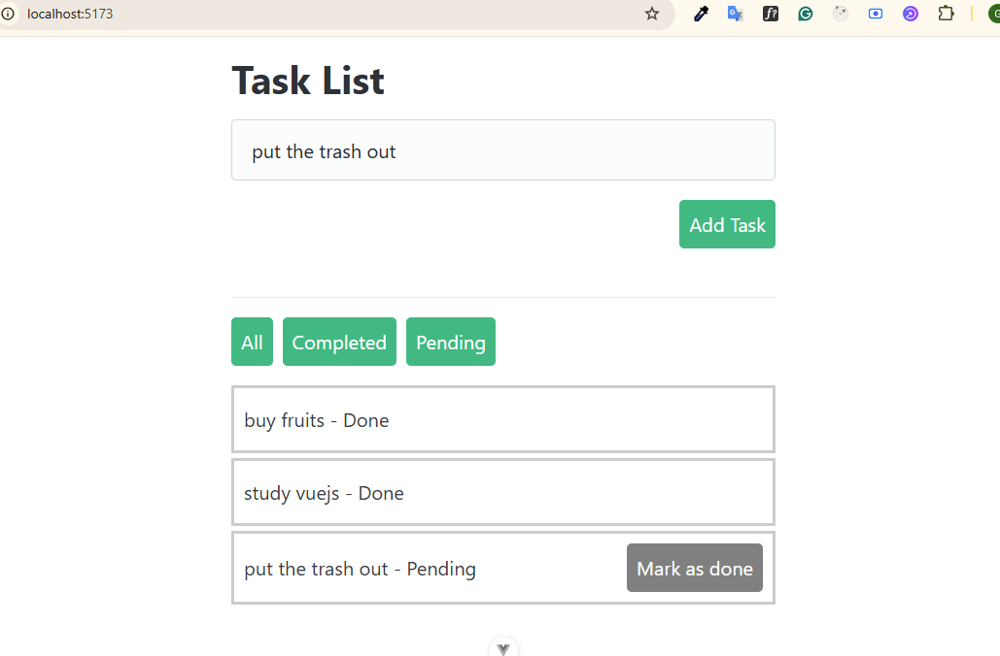

# todo-list

This template should help get you started developing with Vue 3 in Vite.

## Page



## Vue features

- Vue Composition API
- defineProps method
- defineEmits method
- v-for
- v-if
- computed
- @click event
- @keyup.enter event
- ref

## Recommended IDE Setup

[VS Code](https://code.visualstudio.com/) + [Vue (Official)](https://marketplace.visualstudio.com/items?itemName=Vue.volar) (and disable Vetur).

## Project Setup

```sh
npm install
```

### Compile and Hot-Reload for Development

```sh
npm run dev
```

### Compile and Minify for Production

```sh
npm run build
```
